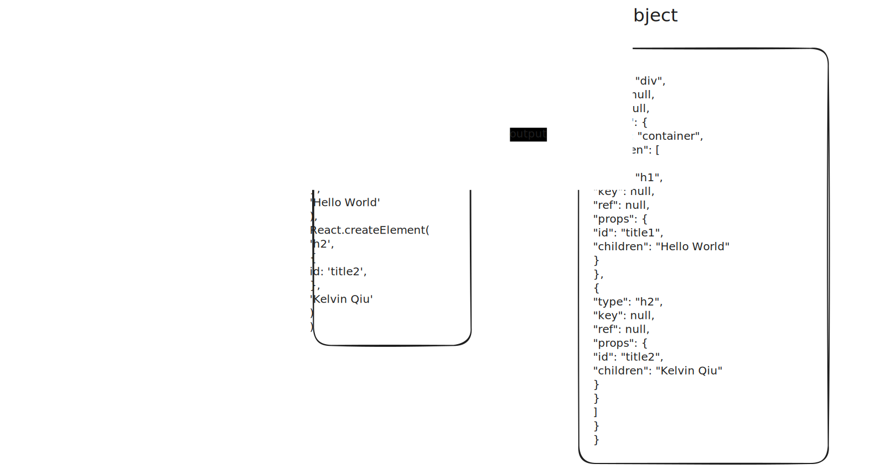

# mini-react

```shell
pnpm i
pnpm run dev
```

## 创建并渲染元素

所有React项目都包含的一行代码

```js
React.createRoot(document.getElementById('root')).render(<App />);
```

第一部分的内容就是模仿`ReactAPI`，实现在页面上渲染元素。

### createElement()

> API文档: [React.createElement(type, props, ...children)](https://react.dev/reference/react/createElement)

- **入参**
  - **type**
    - 可以是`div`这样的标签名
    - 也可以是一个 React 组件（函数组件就是函数，类组件就是类）
  - **props**
    - 属性对象或者`null`
  - **...children**
    - 0 或多个子元素
- **返回值**
  - 一个**JS对象**，来描述元素节点，V-DOM
  - 包含字段`type`, `props`, `ref`, `key`

下图描述了`JSX`是如何经过`Babel`编译和`createElement`函数处理最终变为JS对象的,也就是VDOM


### createRoot()

## 任务调度

由于JS是单线程的，一次性渲染整棵的DOM树会阻塞页面交互，这时需要一种方法能将一个大任务拆分成很多个小任务一次完成。

> [requestIdleCallback(callback)](https://developer.mozilla.org/en-US/docs/Web/API/Window/requestIdleCallback)

使用`requestIdleCallback`可以在浏览器空闲时刻发起渲染，下一步是将渲染整个DOM拆成多个小任务。

目前得到的VDOM树存在子节点无法向上查找父节点，也没办法找到相邻节点，这就导致如果将任务拆分开来，无法通过当前的任务找到下一个任务。为了解决这个问题，需要提出一种新的数据结构，就是`Fiber`。

## Fiber

一个真实的ReactFiber是这样的:
[react-reconciler/src/RectInternalTypes.js](https://github.com/facebook/react/blob/main/packages/react-reconciler/src/ReactInternalTypes.js)
```js
{
  // Instance
  this.tag = tag;
  this.key = key;
  this.elementType = null;
  this.type = null;
  this.stateNode = null;

  // Fiber
  this.return = null;
  this.child = null;
  this.sibling = null;
  this.index = 0;

  this.ref = null;
  this.refCleanup = null;

  this.pendingProps = pendingProps;
  this.memoizedProps = null;
  this.updateQueue = null;
  this.memoizedState = null;
  this.dependencies = null;

  this.mode = mode;

  // Effects
  this.flags = NoFlags;
  this.subtreeFlags = NoFlags;
  this.deletions = null;

  this.lanes = NoLanes;
  this.childLanes = NoLanes;

  this.alternate = null;
}
```

在mini-react中可以简化一下
```js
{
  alternate: IFiber,
  return: IFiber,
  child: IFiber,
  sibling: IFiber,
  type: string | Function,
  stateNode: Node,
  key,
  ref,
  props
}
```

## Render 和 Commit

如果在每一次render完一个fiber，立刻commit到DOM树中，很可能会出现用户同时看到一部分更新后的UI和一部分未更新的UI

为了解决这个问题，需要吧Render和Commit两个阶段分开